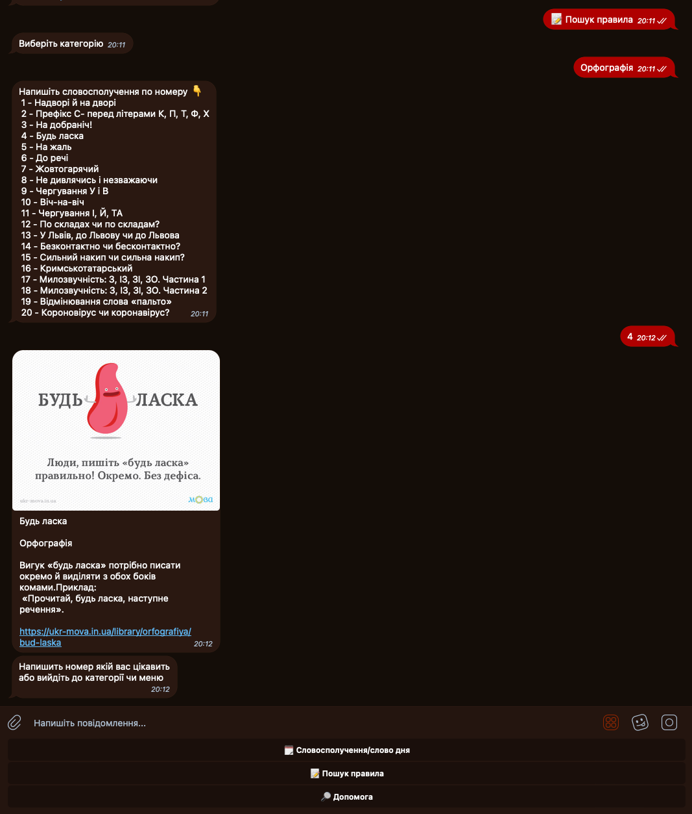
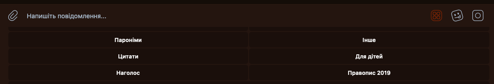

# ukrChatBot

## Про бота
Проект API для роботи з граматикою Telegram ботом
через API сайту https://ukr-mova.in.ua/  

## Особливості

- Працює на Python 3.12
- Бот працює асинхронно через aiogram
- Данні записуються у Mongodb, а не в оперативній памʼяті
- Зручне та просте управління ботом користувачем у Telegram
- логування
- підтримка docker

### Пошук правила


### Словосполучення/слово дня


### Обрання категорій у реальному часі



## Перед встановленням:
- скопіюйте значення з sample.env
- створіть бота через BotFather
- зробіть .env та впишіть значення


## Встановлення додатку через GitHub
```bash
git clone  https://github.com/olefinbrabus/ukrChatBot
cd ukrChatBot
python -m venv venv
pip install .
```

## Запуск додатку через локальний сервер
```bash
python main.py
```

## Запуск додатку через Docker
```bash
docker-compose build
docker-compose up
```
